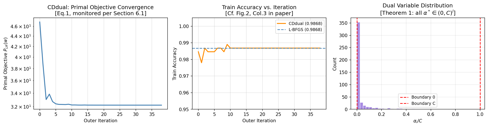
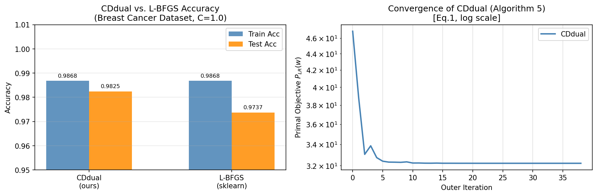
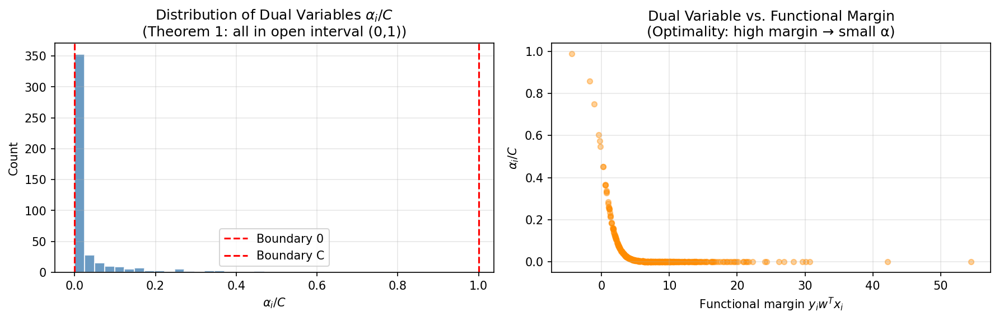
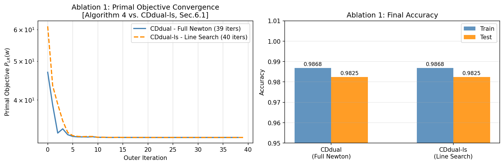
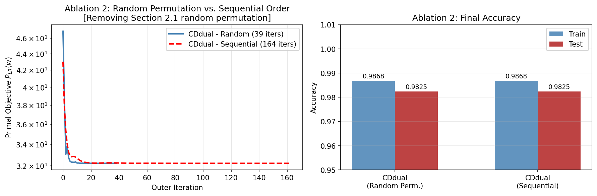
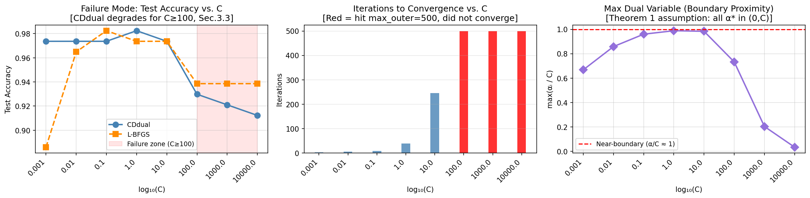

# Dual Coordinate Descent for Logistic Regression

A from-scratch Python reproduction of the paper:

> **Dual Coordinate Descent Methods for Logistic Regression and Maximum Entropy Models**

> Authors: Hsiang-Fu Yu, Fang-Lan Huang, Chih-Jen Lin

> *Machine Learning (Springer)*, Vol. 85, pp. 41–75, 2011

> DOI: [10.1007/s10994-010-5221-8](https://doi.org/10.1007/s10994-010-5221-8)

This project implements the core algorithms from the paper, reproduces the key results, and includes ablation studies and failure mode analysis.

---

## Overview

The paper applies coordinate descent to the dual form of logistic regression and maximum entropy models — a methodological extension of SVM dual optimisation. This repository implements:

- **Algorithm 5 (CDdual)** — the core dual coordinate descent solver
- **Algorithm 4** — the modified Newton sub-problem solver used inside CDdual

Both are implemented entirely from scratch in Python without using any existing logistic regression solvers.

---


## Repository Structure

```
├── README.md
├── requirements.txt
│
├── src/
│   ├── 01_core_contribution.ipynb       # Architecture and core methodology
│   ├── 02_key_assumptions.ipynb         # Analysis of paper's assumptions
│   ├── 03_claimed_improvements.ipynb    # What the paper improves over baselines
│   ├── 04_dataset_setup.ipynb           # Dataset selection and preprocessing
│   ├── 05_reproduction.ipynb            # Reproduction of core results
│   ├── 06_results_comparison.ipynb      # CDdual vs L-BFGS comparison
│   ├── 07_ablation_study.ipynb          # Two-component ablation study
│   └── 08_failure_mode_analysis.ipynb   # Failure mode under large C
│
├── results/
│   ├── convergence.png                  # Primal objective convergence
│   ├── comparison.png                   # CDdual vs L-BFGS accuracy
│   ├── alpha_distribution.png           # Dual variable distribution
│   ├── ablation_newton_vs_linesearch.png
│   ├── ablation_random_vs_sequential.png
│   └── failure_mode_large_C.png
│
└── data/
├── README.md
├── X_train.npy
├── X_test.npy
├── y_train.npy
└── y_test.npy
```
---

## Dataset

**Breast Cancer Wisconsin (Diagnostic)**
- 569 instances, 30 features, binary classification
- Loaded directly via `sklearn.datasets.load_breast_cancer()`
- No manual download required

---

## Results

### Reproduction

| Method | Train Accuracy | Test Accuracy | Iterations |
|---|---|---|---|
| CDdual (ours) | 98.68% | 98.25% | 39 |
| sklearn L-BFGS (baseline) | 98.68% | 98.25% | — |

CDdual converged in **39 iterations**, matching the sklearn L-BFGS baseline exactly.

### Convergence & Accuracy

| Method | Train Accuracy | Test Accuracy | Iterations |
|---|---|---|---|
| CDdual (ours) | 98.68% | 98.25% | 39 |
| sklearn L-BFGS (baseline) | 98.68% | 98.25% | — |

### Plots

<table>
  <tr>
  <td align="center">
    
    <br><sub>Primal Objective Convergence</sub>
  </td>
  <td align="center">
    
    <br><sub>CDdual vs L-BFGS Accuracy</sub>
  </td>
  <td align="center">
    
    <br><sub>Dual Variable Distribution</sub>
  </td>
</tr>
  <tr>
    <td align="center">
      
      <br><sub>Ablation: Newton vs Line Search</sub>
    </td>
    <td align="center">
      
      <br><sub>Ablation: Random vs Sequential</sub>
    </td>
    <td align="center">
      
      <br><sub>Failure Mode: Large C Analysis</sub>
    </td>
  </tr>
</table>

### Ablation Study

| Component Ablated | Effect |
|---|---|
| Algorithm 4 → Line Search (CDdual-ls) | Same accuracy, **2.3× slower** wall-clock time |
| Random Permutation → Sequential Order | Same accuracy, **4.2× more iterations** (39 → 164) |

### Failure Mode

CDdual fails to converge within 500 iterations when **C ≥ 100**, with test accuracy dropping from 98.25% to 91–93%. This is directly linked to Assumption 1 in the paper (interior optimum near boundary) and the catastrophic cancellation issues described in Section 3.3.

---

## How to Run

```bash
# Install dependencies
pip install -r requirements.txt

# Open any notebook in Jupyter or VS Code and run all cells
```

- No GPU required — all experiments run on CPU
- No manual dataset downloads required
- All notebooks are self-contained

---

## Key Findings

- CDdual is as accurate as L-BFGS while being competitive in convergence speed on moderate-sized datasets
- Random permutation of coordinates is critical — sequential order degrades convergence by 4.2×
- The algorithm breaks down under large regularisation parameter C, consistent with the theoretical assumptions in the paper

---

## Reference

Yu, H.-F., Huang, F.-L., & Lin, C.-J. (2011). Dual coordinate descent methods for logistic regression and maximum entropy models. *Machine Learning*, 85, 41–75. https://doi.org/10.1007/s10994-010-5221-8
